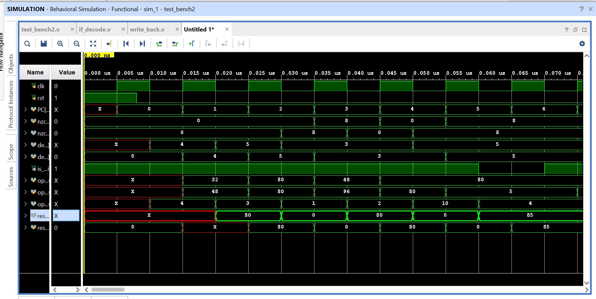
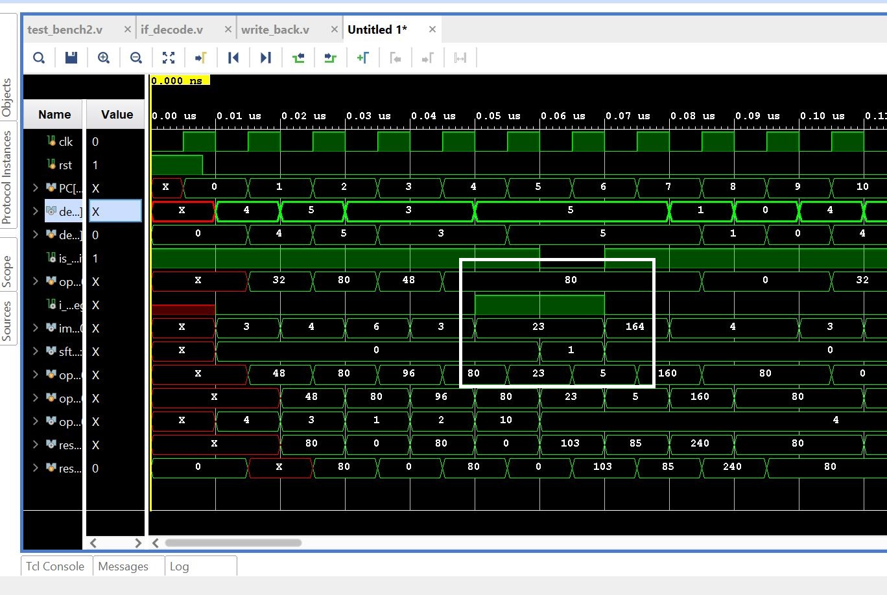

# Pipelined-ALU
# Introduction
This module is a Verilog Implementation of a fully pipelined Arithmetic Logic Unit which is capable of performing all sorts of computations on Integers. The ARM 7 instruction set architecture is followed in the implementation which includes all of the standard operations with a control on weather to write the data back to register file, or not. It also takes care of the dependencies by using data forwarding methods. 
# Requirements
The Xilinx Vivado Design Suite (Vivado 2019.1) was used for HDL sysnthesis and analysis. The installation guide is [here](https://www.xilinx.com/support/download/index.html/content/xilinx/en/downloadNav/vivado-design-tools/2019-1.html). Simulation waveform can be seen on the Vivado Simulator. The instructions are preloaded in the memory as it may not be possible to provide 32 bit instructions manually through the FPGA board. The 32 bit instructions are framed as per the ARM 7 ISA. Here is the [link](http://vision.gel.ulaval.ca/~jflalonde/cours/1001/h17/docs/arm-instructionset.pdf) to the ARM 7 manual.   
# Execution
The 32 bit instructions loaded in the memory get executed in the specified sequence. The execution starts as soon as the reset input is set to 0. Initially the reset is set to 1, which stalls the pipeline execution, in an indirect way. The toggling of the reset input is performed at an instant slightly earlier than the first negative edge of the clock. This enables the execution to start at the negative edge. (This choice of the clock edge was arbitrary prior to the design, but now, for the proper working of the design, execution should start at the negative edge). The decoding and execution steps are performed at the consecutive negative edges of the clock (in a pipelined manner) while the Write back is performed at the positive edge. This ensures the proper write back and reading of data (as both at separarted at different clock edges). Moreover, data forwarding is incorporated to ensure proper execution when the register to be written is same as the next input rgister. 
# Pipeline
The pipelined architecture is shown in the following diagram where the consecutive placement (and execution) of Decode, Execution and Write back module can be seen easily.   
# Simulation and Output
The simulation can be easily generated using the Vivado simulator (and the testbench provided alongwith the design). Here is a snippet of the simulation output   The output shown on the board consists of the 16 LSBs of the register number n (out of the 16 registers in the Register file). The position of the register n, can be specified as an input (in 4 bits) given through the board. 
# Immediate operand
The second operand in the instruction can either be a value stored in a register or an immediate value. There is a specified bit in the instruction which implies wheather the immediate or register operand has been used. The following simulation shows the instruction bit and hence the value assigned to the second operand. 
# Conclusion
This module provides a complete implementation of the pipelined ALU. 
